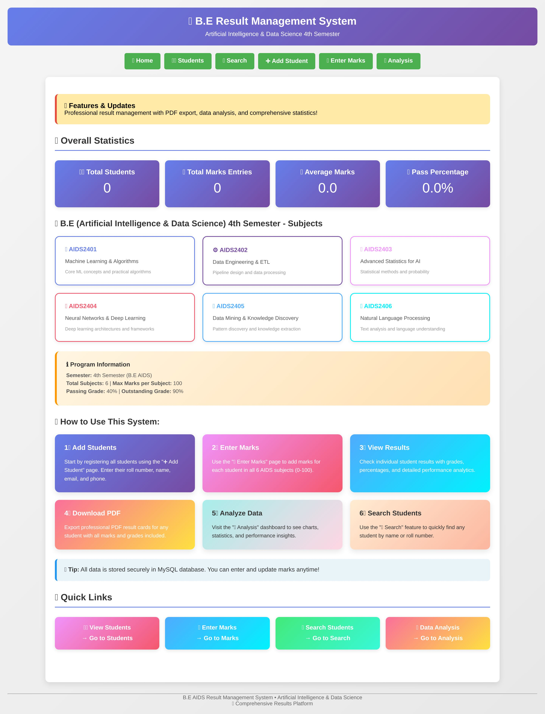
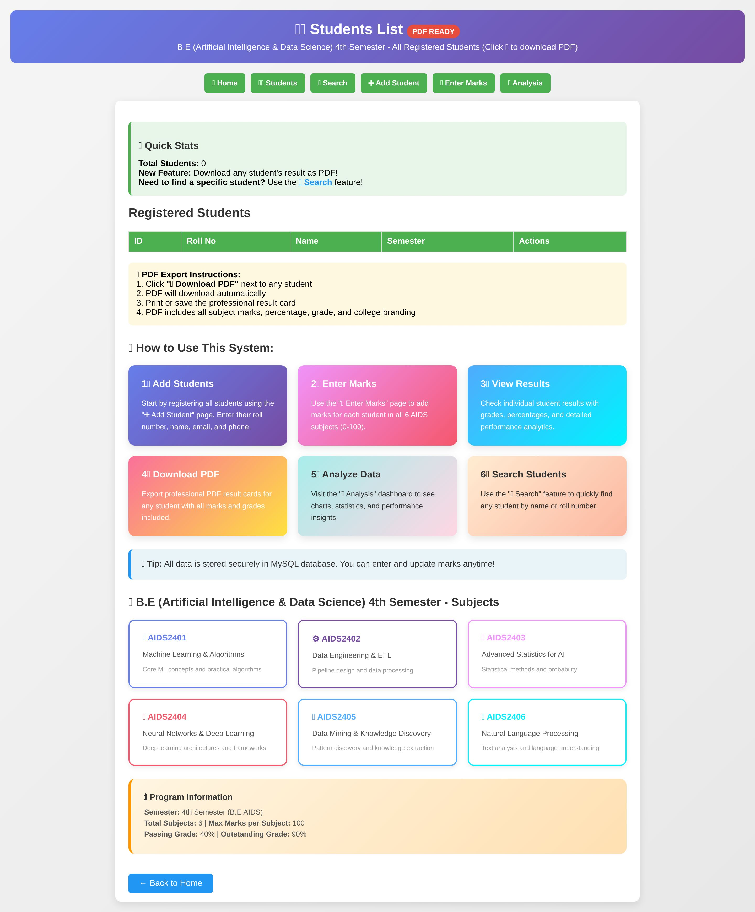
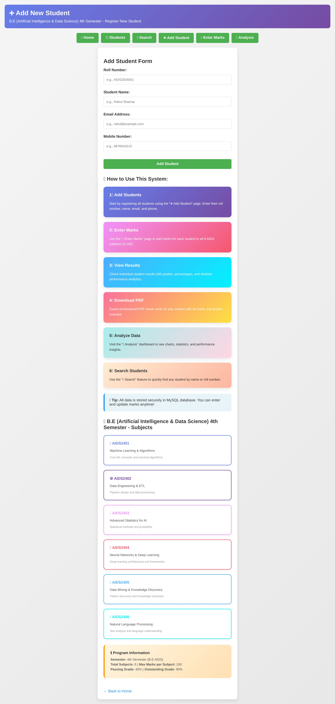
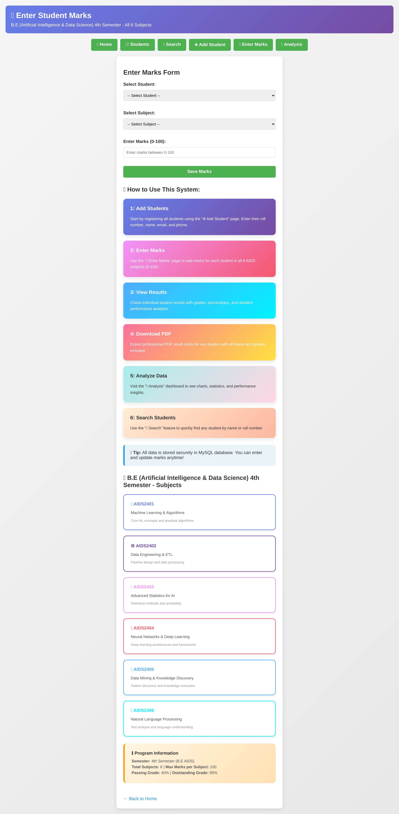
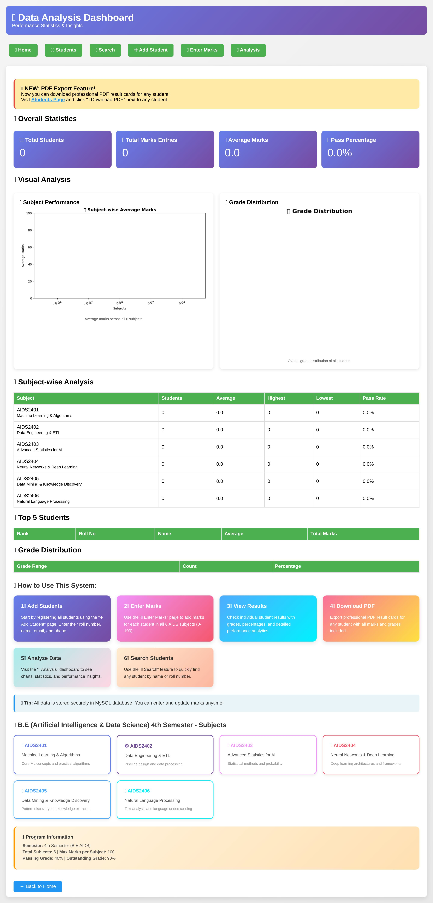

# Result Management System

## 📌 Project Overview
This is a Result Management System built using Flask and SQLite.  
It helps manage student data, calculate result percentages and grades, and export result cards as PDF.

---

## 🚀 Features
- Add, update, and delete student records  
- Enter marks for each subject  
- Automatic percentage & grade calculation  
- View charts of subject averages and grade distribution  
- PDF result card generation  
- Search by roll number  

---

## 🛠️ Technologies Used
- Python  
- Flask  
- MySQL 
- Pandas  
- Matplotlib  
- ReportLab  
- HTML, CSS  

---

## ⚙️ Installation & Setup

### 1️⃣ Clone Repository
```bash
git clone https://github.com/amrut20562/result-management-system.git
cd result-management-system
```

### 2️⃣ Install Requirements
```bash
pip install -r requirements.txt
```

### 3️⃣ Create Database
```bash
python database.py
```

### 4️⃣ Run the App
```bash
python app.py
```

Open your browser and go to:
```
http://127.0.0.1:5001/

```

---

## 📂 Project Structure
```
result-management-system/
│
├── app.py
├── database.py
├── add_real_students.py
├── requirements.txt
├── templates/
├── static/
├── README.md
└── .gitignore
```

---

## 📸 Screenshots

### 🏠 Home Page


### 📋 Students List


### ➕ Add Student


### 📝 Enter Marks


### 🔎 Search Student


### 📊 Analysis Dashboard


---

## 👩‍💻 Author
Amrut more
B.E AIDS Student
